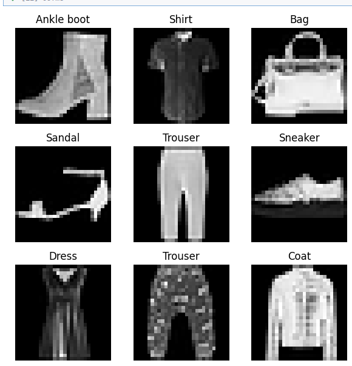

# CS_417_Project
# **Fashion Item Classification Using a Convolutional Neural Network (CNN)**
 Project Description
This project focuses on the computer vision task of fashion item classification. We utilize a Convolutional Neural Network (CNN) to identify the category of clothing items from images. The goal is to classify images  using a relatively simpler, low-resolution dataset while demonstrating how CNNs learn features such as edges, textures, and shapes. This serves as a stepping stone to more complex image-processing tasks and has practical applications in e-commerce and retail inventory management.

# **Dataset**

* **Dataset Name**: Fashion MNIST
The primary dataset is Fashion MNIST

* **Characteristics**: 70,000 grayscale images at 28x28 pixels resolution.
* **Categories**   (10 Classes): T-shirt/top, Trouser, Pullover, Dress, Coat, Sandal, Shirt, Sneaker, Bag, Ankle boot.


**Dataset Link**
The Fashion MNIST dataset is available directly through major deep learning libraries.
# ***Data Sample***


**Source**: Available from TensorFlow/Keras datasets or online (Zalando Research).

# **_How to Install Dependencies_**
To run the training and evaluation scripts, you will need Python and the core deep learning libraries.
 * TensorFlow/Keras for the CNN model
 *  scikit-learn for evaluation metrics

`pip install tensorflow keras scikit-learn`


# **How to Run the Training Script**
`python code/train.py`

# **How to Run Evaluation**

`python code/evaluate.py`

The evaluation script will load the saved model and test its performance on the 10,000 image test set.

The evaluation measures will include Test accuracy, a Confusion matrix, and Class-wise precision, recall, and F1-score.

# **How to Load the Saved Model for Inference**
To use the trained model for making predictions on new, unseen fashion images (inference), you can load the saved model file.

## 5. How to Load the Saved Model for Inference

To use the trained model for making predictions on new, unseen fashion images (inference), you can load the saved model file.

```python
import tensorflow as tf
from tensorflow import keras

# Define the absolute path to your saved model file
MODEL_PATH = 'saved_model/best_model.h5' 

# Load the model
model = keras.models.load_model(MODEL_PATH)

# The model is now ready to classify new 28x28 pixel images
# Example inference (requires the new_image to be preprocessed: 28x28, normalized 0-1)
# predictions = model.predict(new_image)